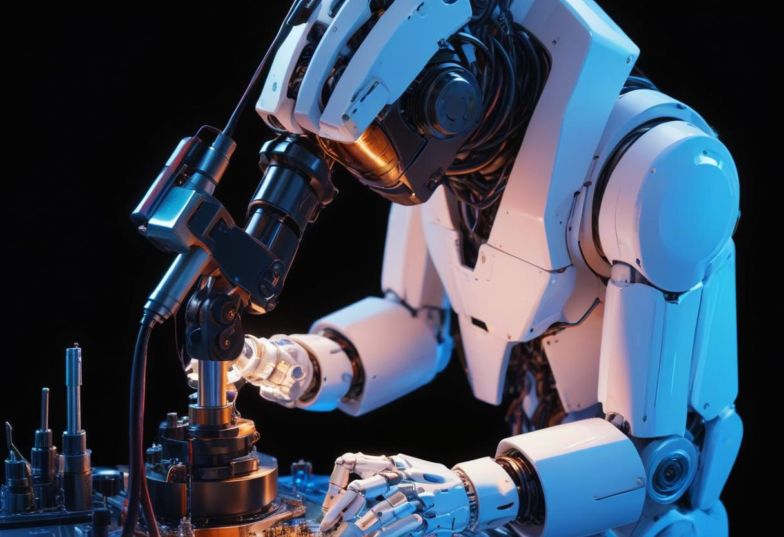

---

<h1 align="center">Hi, I'm Devanik</h1>
<h3 align="center">Aspiring AI & ML Researcher | ECE Undergrad at NIT Agartala</h3>

  

---

### 🚀 **About Me**

- 🔭 Currently working on **Reinforcement Learning and Generative AI**.
- 🌱 Learning **Data Structures and Algorithms (C++), Deep Learning, Reinforcement Learning**.
- 👯 Looking to collaborate on **Machine Learning and AI projects**.
- 🏆 Achieved **1st Place** in Space Exploration Hackathon by ISRO STIC and NIT Agartala.
- 👨‍💻 Developed over 15 applications using **Streamlit**, integrating various robust ML models.

---

### 💼 **Experience**

- **Machine Learning Intern** at Bharat Intern (Feb 2024)  
  - Developed a house price prediction model using Multiple Linear Regression.  
  - Conducted Iris flower classification using various ML algorithms.

- **TCS ESG Job Simulation on Forage** (May 2024)  
  - Completed a sustainability consulting simulation, developed a fitment matrix for client needs.

- **Accenture North America Data Analytics Job Simulation on Forage** (May 2024)  
  - Analyzed and modeled datasets to uncover insights, created presentations for stakeholders.

---

### 🔬 **Projects**

- **Supervised Machine Learning - Model Selection**  
  - Selected optimal models for cancer cell classification, achieving high accuracy and precision.

- **Unsupervised Machine Learning**  
  - Employed K-means clustering for customer segmentation and Apriori for market basket analysis.

- **Deep Learning**  
  - Implemented RNNs for stock price prediction and CNNs for image classification using advanced architectures like VGG16 and ResNetV2.

---

### 🏅 **Achievements**

- **LeetCode:** Earned 3 stars, 50 DAYS, and 100 DAYS BADGE (2023 & 2024).
- **Industry Certifications:** Recognized by IBM, Google, TCS, Accenture, FreeCodeCamp, and Microsoft.

---

### 🛠️ **Skills**

- **Languages:** Python, C++, C, MATLAB, SQL
- **Developer Tools:** Git, Kaggle, VS Code, PyCharm, Anaconda, MySQL, Streamlit
- **Libraries:** Pandas, NumPy, Matplotlib, Seaborn, Scikit-Learn, TensorFlow, Keras, PyTorch

---

### 🌐 **Connect with me**

  
  
  
  
  
  

---

### 💻 **Languages and Tools**

  
  
  
  
  
  
  
  
  
  

---

### 📊 **GitHub Stats**

  
  
  

---

### 💡 **Fun Fact**
I believe that AI, when harnessed correctly, can increase human lifespan to infinity. Curious? Let's explore together!

---
