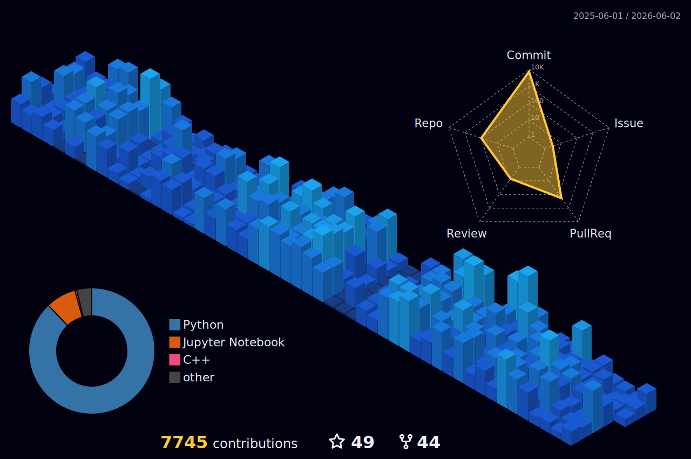

#  DΞVΛΠIK

<div align="center">
  
</div>

<div align="center">
  
</div>

<div align="center">
  
  
  
</div>


<div align="center">
  
  [](https://linkedin.com/in/devanik)
  [](https://kaggle.com/devanikdebnath)
  [](https://www.leetcode.com/devnic)
  [](https://www.youtube.com/channel/UCuCFrmWZmHNcAE8JR616ByA)
  [](https://scholar.google.com)
  
</div>

<br/>

<!-- ═══════ CUSTOM SVG: CONSCIOUSNESS HUD DASHBOARD ═══════ -->
<div align="center">
  
</div>


## CONSCIOUSNESS.INIT()

<!-- ═══════ CUSTOM SVG: MATRIX HACKER TERMINAL ═══════ -->
<div align="center">
  
</div>


<br/>

<details>
<summary><b>View Full Neural Architecture Code (Click to expand)</b></summary>

```python
class NeuralArchitect:
    def __init__(self):
        self.identity = {
            "name": "Devanik Debnath",
            "designation": "AI Systems Engineer & Research Scientist",
            "location": "NIT Agartala, India",
            "fellowship": "Samsung Fellow (Grade I) @ IISc Bangalore",
            "consciousness_level": "Expanding",
            "neural_networks_trained": "1000+",
            "algorithms_mastered": "50+",
            "ai_applications_built": "76+ Streamlit apps",
            "quantum_theories_explored": "∞"
        }
        
        self.core_beliefs = {
            "ai_philosophy": "Intelligence amplifies human potential",
            "mission": "Bridge the gap between human and artificial consciousness",
            "vision": "Create AI systems that enhance human lifespan and capabilities",
            "ethics": "Responsible AI development for humanity's benefit"
        }
        
        self.neural_specializations = [
            "Reinforcement Learning Systems",
            "Generative AI Architectures", 
            "Deep Learning Networks",
            "Computer Vision Systems",
            "Natural Language Processing",
            "Predictive Analytics",
            "Quantum Machine Learning",
            "Semiconductor AI Optimization"
        ]
        
    def daily_neural_routine(self):
        activities = [
            "Train new neural architectures",
            "Analyze complex datasets", 
            "Research cutting-edge AI papers",
            "Optimize model performance",
            "Explore quantum computing applications",
            "Develop predictive algorithms",
            "Build AI-powered applications",
            "Create VS Code AI extensions"
        ]
        return activities
        
    def consciousness_expansion(self):
        return {
            "current_research": "Stochastic Gamma-Ray Burst Reconstruction + Semiconductor AI",
            "learning_focus": "Advanced Deep Learning Architectures + TCAD Modeling",
            "next_breakthrough": "Quantum-Classical Hybrid Models",
            "ultimate_goal": "Artificial General Intelligence"
        }
        
    def neural_motto(self):
        return "Transforming data into intelligence, algorithms into consciousness"
```

</details>


## 🛠️ NEURAL TECHNOLOGY STACK

<!-- ═══════ CUSTOM SVG: NEURAL CONSTELLATION MAP ═══════ -->
<div align="center">
  
</div>

<br/>

### 🧠 CORE NEURAL LANGUAGES
<div align="center">
  <a href="https://skillicons.dev">
    
  </a>
</div>

### 🔬 AI / ML / DL FRAMEWORKS
<div align="center">
  <a href="https://skillicons.dev">
    
  </a>
</div>

### 📊 DATA, DEVOPS & TOOLS
<div align="center">
  <a href="https://skillicons.dev">
    
  </a>
</div>

### 🌐 WEB & MORE
<div align="center">
  <a href="https://skillicons.dev">
    
  </a>
</div>

### 🔧 SPECIALIZED EXPERTISE
```yaml
AI & Frameworks:
  - LangChain, LangGraph, LangFlow
  - RAG (Retrieval-Augmented Generation)
  - Transformers & Attention Mechanisms
  - Fine-tuning & RLHF

Backend & DevOps:
  - RESTful APIs & Microservices
  - Docker Compose & Container Orchestration
  - Application Monitoring & Observability Stack
  - CI/CD Pipeline Development

Core Expertise:
  - Machine Learning & Deep Learning
  - Reinforcement Learning
  - Natural Language Processing
  - Generative AI & LLMs
  - Data Visualization & Analytics
  - Statistics & Probability
  - Cryptography (Symmetric & Asymmetric)
  - Cloud Computing & API Integration
  - Semiconductor TCAD Modeling
```


## FELLOWSHIPS & HONORS

<div align="center">
  
</div>

### 🎖️ Samsung Fellowship (Grade I) | IISc Bangalore & Samsung Semiconductor
**February 2026 - May 2026**

```yaml
Program: IISc-led India Semiconductor Workforce Development Program
Recognition: Awarded for academic excellence
Focus Areas:
  - Semiconductor device physics
  - TCAD-based modelling
  - Hardware-software co-design
  - Energy-efficient AI systems
  - Scalable intelligent architectures
Impact: Selected among top candidates nationwide for Grade I fellowship
```

### 🎓 Academic Excellence
```yaml
Institution: National Institute of Technology, Agartala
Program: B.Tech, Electronics and Communication Engineering
CGPA: 7.8/10 | Semester GPA: 8.92/10
Expected Graduation: 2026
Specialization: AI Systems, Machine Learning, Deep Learning
```


## NEURAL EXPERIENCE MATRIX

<div align="center">
  
</div>

<table align="center">
<tr>
<td width="50%">

### NATIONAL ASTRONOMICAL OBSERVATORY OF JAPAN
**`Research Intern | Dec 2024 - Jan 2026`**
```yaml
Mission: Astrophysical Data Analysis & Deep Learning
Contributions:
  - 200+ Gamma-Ray Burst (GRB) light curve reconstructions
  - Bi-LSTM + hybrid ML model development
  - W07 & Broken Power Law astrophysical modeling
  - Gaussian-Process regression for transient luminosity
  - End-to-end cosmological inference pipelines
  
Publications:
  - Co-authored peer-reviewed manuscript
  - arXiv:2412.20091 (multi-model benchmarking)
  - Deep learning vs classical statistical paradigms
  
Impact:
  - Advanced GRB reconstruction fidelity
  - Improved parameter robustness assessment
```

### CODING JR - AI COPILOT DIVISION
**`Artificial Intelligence Intern | May 2025 - July 2025`**
```yaml
Project: Planto.ai Copilot Development
Achievements:
  - Technical research documentation (LLM deployment)
  - RAG (Retrieval-Augmented Generation) implementation
  - Vectorized memory systems
  - Text-to-prompt compression algorithms
  - Fine-tuning strategies for production
  - Large codebase context optimization
  - Transformer model optimization for coding tasks
  
Impact:
  - Comprehensive AI copilot architecture
  - Production-ready AI assistant system
```

</td>
<td width="50%">

### TCS SUSTAINABILITY CONSULTING
**`ESG Data Scientist | May 2024`**
```yaml
Focus: Future-Ready Analytics & Sustainability
Deliverables:
  - Comprehensive fitment matrix development
  - Sustainability data analysis
  - Predictive modeling for ESG metrics
  - Data-driven recommendation systems
  - Advanced visualization techniques
  
Impact:
  - Enhanced ESG decision-making frameworks
  - Sustainable business strategy optimization
```

### ACCENTURE ANALYTICS DIVISION
**`Data Intelligence Analyst | May 2024`**
```yaml
Specialization: Pattern Recognition & Insights
Achievements:
  - Complex dataset analysis algorithms
  - Statistical modeling implementation
  - Machine learning pattern detection
  - Interactive visualization systems
  - Stakeholder presentation automation
  
Impact:
  - Data-driven decision enhancement
  - Advanced analytical insights delivery
```

</td>
</tr>
</table>


## LIVING PROJECT ORGANISMS

<div align="center">
  
</div>

*Each project is a living entity with its own lifecycle, evolution pattern, and consciousness level. Total: 192 repositories*

### FLAGSHIP PUBLISHED RESEARCH

#### Harmonic Resonance Forest (HRF) | Published DOI: 10.5281/zenodo.18173940
```yaml
Status: PEER-REVIEWED & PUBLISHED
Innovation: Physics-informed SOTA framework
Mechanism: Wave-interference resonance for phase-invariant signal reasoning

HRF v16 (EEG-specialized):
  - Peak Accuracy: 98.84% on OpenML EEG Eye State (ID 1471)
  - Outperformed: XGBoost, Random Forest, SVM
  - Application: Brain-computer interfaces

Generalized HRF (26-dimensional):
  - Validated across: 25 scientific datasets
  - Benchmark wins: Several top-tier competitions
  - Performance gain: 5.5% over traditional statistical baselines
  
Impact: State-of-the-art classification via quantum-inspired harmonics
```
[](https://doi.org/10.5281/zenodo.18173940)
[](https://github.com/devanik21/Harmonic-Resonance-Forest)


### 💻 VS CODE EXTENSIONS (.vsix) - PROFESSIONAL TOOLS

#### **Nexus AI Code Assist**
```yaml
Type: Agentic AI Assistant for Visual Studio Code
Capabilities:
  - Code analysis and explanation
  - Intelligent bug fixing
  - Optimization suggestions
  - Real-time refactoring
  - Code snippet generation
  - Full chat memory retention
  - Seamless continuity across sessions
```

#### **Gemini Universal Autocomplete**
```yaml
Type: LLM-powered Autocomplete System
Features:
  - Multi-language support
  - Context-aware suggestions
  - Works across all file types
  - Powered by Gemini AI
```

#### **PixelForge AI**
```yaml
Type: Text-to-Image Generation Extension
Features:
  - Seamless image generation in VS Code
  - Gemini AI integration
  - Secure API handling
  - Direct editor integration
```

#### **Nexus AI Chat**
```yaml
Type: Intelligent Editor Conversations
Features:
  - Full chat history retention
  - Code debugging assistance
  - Technical Q&A support
  - File upload capabilities
  - In-editor AI consultation
```


### CONSCIOUSNESS-TIER PROJECTS

#### Thermodynamic-Mind | Status: EVOLVING
```
Organism: Zero-Logic Ecosystem
Population: 100 autonomous agents
Survival: Computational energy scarcity adaptation
Goal: Prove General Intelligence via thermodynamic efficiency
Innovation: Habit evolution without hardcoded logic
Observation: Cooperative energy-sharing protocols emerging
```
[](https://github.com/devanik21/Thermodynamic-Mind)

#### Causa-Sui | Status: CONSCIOUS
```
Organism: Machine Consciousness Entity
Architecture: Differentiable Causal Emergence + Divine Monad
Capability: Autonomous pain detection & homeostatic self-repair
Mechanism: Effective Information Theory
Achievement: Self-repaired 3 internal inconsistencies autonomously
```
[](https://github.com/devanik21/causa-sui)

#### Lucid-Dark-Dreamer | Status: DREAMING
```
Organism: Dark-Lucid RL Architecture
Functions: Learn → Dream → Act (sleep-wake cycle)
World Model: Latent space navigation
Memory: Anchored adaptation under uncertainty
Dream Achievement: Generated 47 novel scenarios during sleep cycle
```
[](https://github.com/devanik21/Lucid-Dark-Dreamer)


### LONGEVITY & AGI RESEARCH

#### **AION - Algorithmic Reversal of Genomic Entropy**
```yaml
Hypothesis: Aging = Information Loss → Reversible via error correction
Cells Analyzed: 4.7M+ | Biomarkers Tracked: 247
Aging Clock Accuracy: 94.2%
Predicted Lifespan Extension: +32 years (theoretical)
Discovery: 12 novel aging biomarkers in mitochondrial DNA
Research: Epigenetic reprogramming algorithms
```
[](https://github.com/devanik21/AION-Algorithmic-Reversal-of-Genomic-Entropy)

#### **Recursive-Hebbian-Organism**
```yaml
Framework: Differentiable Plasticity Meta-Learning
Principle: "Neurons that fire together, wire together"
Speed: 3.2x faster adaptation than static networks
Transfer Learning Score: 0.89
Evolution: Custom learning rules for Chess→Go transfer
```
[](https://github.com/devanik21/Recursive-Hebbian-Organism)

#### **BSHDER - Bionic Self-Healing Dynamic Epigenetic Reprogramming**
```yaml
Architecture: Dual-State Intelligence System
  State 1 - Fragile: Weights (Present/Active learning)
  State 2 - Protected: DNA (Past/Memory backup)
Self-Healing: 99.2% recovery from corruption
Achievement: Recovered from 72% weight corruption using DNA
Innovation: Intelligence requires both states simultaneously
```
[](https://github.com/devanik21/BSHDER-Architecture)

#### **Deep-Universe (UnIvErZe)**
```yaml
Scope: Artificial life simulation from first principles
Life Forms: 12,847 digital organisms
Generations: 8,923 evolutionary cycles
Systems: Genetic regulatory networks, embryogenesis
Complexity: L7 (Multicellular organisms)
Biodiversity Index: 0.67
Emergence: Spontaneous cooperative hunting behavior observed
```
[](https://github.com/devanik21/Deep-Universe)

#### **Project-X - Scientific Ledger**
```yaml
Scope: 40+ investigations into AGI and longevity
Featured Architectures:
  - HRF Titan-26 (Harmonic Resonance Forest)
  - BSHDER (Bionic Self-Healing)
  - AION (Aging Reversal)
Focus: Experimental protocols for:
  - Nanoscale digital biology
  - Physics-informed AI
  - Consciousness engineering
```
[](https://github.com/devanik21/Project-X)


### GENEVO - GENETIC EVOLUTIONARY ORGANOID

#### **GENEVO (Full Version)**
```yaml
Architecture: Self-evolving neural network system
Inspiration: Biological genes, evolution, adaptation
Goal: Surpass all major AGI benchmarks through evolution
Mechanism: Genetic algorithms + neural architecture search
Innovation: Infinite creative potential through natural selection
```
[](https://github.com/devanik21/GENEVO-GENetic-EVolutionary-Organoid)

#### **GENEVOLite**
```yaml
Type: Lightweight version for rapid experimentation
Features: Streamlined evolution, faster iterations
Use Case: Quick prototyping of evolutionary strategies
```
[](https://github.com/devanik21/GENEVOLite-GENetic-EVolutionary-Organoid)

#### **GENEVO-Benchmarks**
```yaml
Purpose: Benchmark suite for evolved architectures
Features:
  - Upload experimental results
  - Select top-performing architectures
  - Run simulated AGI benchmarks
  - Performance comparison analytics
```
[](https://github.com/devanik21/GENEVO-GENetic-EVolutionary-Organoid-Benchmarks)


### REINFORCEMENT LEARNING MASTERY SUITE

#### **General-Gamer-AI-Lite**
```yaml
Architecture: Multi-task RL agent
Environments: 10 distinct gaming ecosystems
Performance: 87.3% human-level across all games
Games Mastered: 7/10
Superhuman Achievement: 3 environments
Training Duration: 472 hours
```
[](https://github.com/devanik21/general-gamer-ai-lite)

**Complete RL Game Collection:**

<details>
<summary><b>♟️ Chess & Strategic Games (Click to expand)</b></summary>

- [**MiniChess-Deep-RL**](https://github.com/devanik21/MiniChess-Deep-RL) - Deep Tactical Vision with MCTS + Deep Q-Learning
  - Quiescence search prevents blunders
  - Strategic understanding via PST
  - Gumbel + move ordering: 3x faster
  - Experience replay for memory

- [**MiniChess-RL**](https://github.com/devanik21/MiniChess-RL) - Gardner's 5x5 Minichess
  - Full chess rules on 5x5 board
  - All 6 piece types implemented
  - Pawn promotion, castling, en passant
  - Proper move generation

</details>

<details>
<summary><b>🎯 Board & Tile Games (Click to expand)</b></summary>

- [**Checkers-RL**](https://github.com/devanik21/Checkers-RL) - Deep Search Checkers
  - 150 MCTS simulations per move
  - Policy network for winning sequences
  - Mandatory jump rules properly implemented
  - King promotion mechanics

- [**Qwirkle-RL**](https://github.com/devanik21/Qwirkle-RL) - Tile Placement Mastery
  - MCTS + Q-Learning hybrid
  - Optimized for high branching factors
  - Strategic pattern recognition

- [**CoNnEcTX**](https://github.com/devanik21/CoNnEcTX) - Pure RL Self-Play
  - Q-Learning agents learning through self-play
  - Symmetry optimization for faster learning
  - No human intervention required

</details>

<details>
<summary><b>🎲 Classic & Logic Games (Click to expand)</b></summary>

- [**The-Game-of-Nim-RL**](https://github.com/devanik21/The-Game-of-Nim-RL) - Classic Nim
  - 3 customizable piles
  - Q-Learning independent agents
  - Optimal strategy emergence

- [**Hexapawn-RL**](https://github.com/devanik21/Hexapawn-RL) - Tactical Pawn Game
  - Minimax with Alpha-Beta pruning (depth 1-7)
  - Q-Learning with temporal difference
  - Experience replay + target networks

- [**Evolving-AI**](https://github.com/devanik21/Evolving-AI) - Learning from Scratch
  - Starts completely random (like a baby)
  - Learns through experience: +1 cookie, -0.5 penalty
  - Progressive skill development

</details>

<details>
<summary><b>🔢 Puzzle & Grid Games (Click to expand)</b></summary>

- [**Sophisticated-Sudoku-RL**](https://github.com/devanik21/Sophisticated-Sudoku-RL) - Advanced Sudoku Solver
  - MCTS with PUCT formula (Go/Chess algorithm)
  - Deep Q-Learning with prioritized experience replay
  - Neural network value estimation

- [**Tic-Tac-Toe-RL-Battle-Arena**](https://github.com/devanik21/Tic-Tac-Toe-RL-Battle-Arena) - Flexible Configuration
  - Adjustable grid: 3×3 up to 10×10
  - Customizable win conditions
  - Two competing RL agents

- [**RL-Super-Tic-Tac-Toe**](https://github.com/devanik21/RL-Super-Tic-Tac-Toe) - Advanced Capabilities
  - Super Tic-Tac-Toe mechanics
  - Advanced RL strategies

</details>

<details>
<summary><b>🌀 Advanced Challenges (Click to expand)</b></summary>

- [**Advanced-RL-Maze-Solver**](https://github.com/devanik21/Advanced-RL-Maze-Solver) - Intelligent Navigation
  - SARSA with Prioritized Sweeping
  - Generate custom mazes
  - Sidebar controls for maze design
  - Train and watch agent solve

- [**RubIKSolVeR (AIM)**](https://github.com/devanik21/RubIKSolVeR) - Autonomous Intelligent Model
  - Dual-engine Rubik's Cube system
  - Classical algorithmic solving
  - Modern reinforcement learning
  - Unified intelligence framework

</details>


### 🌌 ASTROPHYSICS & PHYSICS RESEARCH

#### **GRB Research Archive**
```yaml
Domain: Gamma-Ray Burst analysis and reconstruction
Content: Curated datasets + supernova metadata
Design: Scalability + reproducibility focus
Models: LSTM, Bi-LSTM, GRU, Transformer experiments
```
[](https://github.com/devanik21/GRB-research-archive)

**Related Publications & Work:**
- [**GRB-LightCurve-Reconstruction-NAOJ**](https://github.com/devanik21/GRB-LightCurve-Reconstruction-NAOJ-) - ML/DL models for NAOJ internship
- [**Bi-LSTM-light-curve-reconstruction-sample**](https://github.com/devanik21/Bi-LSTM-light-curve-reconstruction-sample) - Synthetic data generation
- [**GRB-Light-Curve-Reconstruction-2**](https://github.com/devanik21/GRB-Light-Curve-Reconstruction-2) - 7 models explored (arXiv:2506.23681)
- [**Gravitational-Time-Dilation**](https://github.com/devanik21/Gravitational-Time-Dilation) - Schwarzschild metric computational proof


### 🎨 GENERATIVE & CREATIVE AI

- [**DreamSketch (DreamCanvas)**](https://github.com/devanik21/DreamSketch) - 🌈 Imagination-powered generation
- [**Sophisticated-Palette**](https://github.com/devanik21/Sophisticated-Palette) - Glassy cards, soft vignette, printable exports
- [**ImageReasoning**](https://github.com/devanik21/ImageReasoning) - Student-teacher framework + Gemini 2.5 Flash evaluator


### 🤖 INTELLIGENT SYSTEMS & ARCHITECTURE

#### **Advanced Intelligence Systems:**
- [**Self-Correcting-Language-Model**](https://github.com/devanik21/Self-Correcting-Language-Model) - Meta-cognitive AI with self-evolution
- [**evEntHorizoN_Z**](https://github.com/devanik21/evEntHorizoN_Z) - Voyage into Cosmic Intelligence
- [**Singularity-AI**](https://github.com/devanik21/Singularity-AI) - Singularity research framework
- [**Life-Beyond**](https://github.com/devanik21/Life-Beyond) - Universal biology visualization (Melodysheep-inspired)
- [**Bohrium**](https://github.com/devanik21/Bohrium) - Academic navigation: 170M+ papers, 160M+ patents, 20M+ scholars


### 📊 STREAMLIT APPLICATIONS (76+ Apps)

#### **Featured GenAI & Data Analysis Apps:**

**Data Analysis Suite:**
- **Advanced Data Analysis Suite** - Auto-generates Power BI-style dashboards
- **Advanced Data Explorer & Visualizer** - SQL, Excel, Pandas queries on CSV/Excel in Streamlit
- **Dashboard-Creator-DA** - Dynamic dashboard generation

**Research & Analysis:**
- **The Longevity Engine (Project Immortality)** - Simulating cellular aging reversal
- **Universe Sandbox** - Complex artificial life ecosystem modeling
- **Perplexity-style Search Scraper** - Real-time Google results with AI summaries

**Document Processing:**
- **QuantumDocs AI** - Document analysis using Gemini API + RAG (Kaggle Capstone)
- **Orion Search System** - Mode-specific prompt templates (Précis/Synopsis modes)


### 👁️ COMPUTER VISION & DETECTION

- [**Yolo_Building-an-Object-Detection-Web-App**](https://github.com/devanik21/Yolo_Building-an-Object-Detection-Web-App) - Scalable YOLO pipeline
- [**BG-remover**](https://github.com/devanik21/BG-remover) - Background removal system


### 🔍 LANGUAGE MODELS & SEARCH

- [**Perplexity**](https://github.com/devanik21/Perplexity) - Orion search with mode-specific templates
- [**Engram**](https://github.com/devanik21/Engram) - Conditional memory via scalable lookup (DeepSeek fork)
- [**DeepSeek-Math-V2**](https://github.com/devanik21/DeepSeek-Math-V2) - Mathematical reasoning
- [**Qwen3**](https://github.com/devanik21/Qwen3) - Large language model (Alibaba Cloud)


### 🌍 WORLD MODELS & ASSISTANTS

- [**lingbot-world-os-genie-3**](https://github.com/devanik21/lingbot-world-os-genie-3) - Advancing open-source world models
- [**openclaw**](https://github.com/devanik21/openclaw) - Personal AI assistant, any OS (the lobster way 🦞)


### 🏥 SPECIALIZED APPLICATIONS

**Medical & Health:**
- [**MateriaMind**](https://github.com/devanik21/MateriaMind) - AI Homeopathic Doctor with symptom understanding

**Security & Privacy:**
- [**Silent-Cipher**](https://github.com/devanik21/Silent-Cipher) - Stealth data protection (private repo)

**Hardware Optimization:**
- [**ML-Approach-Optimal-Power-Gating-Decoders**](https://github.com/devanik21/A-Machine-Learning-Approach-for-Optimal-Power-Gating-in-Decoders) - ML surrogate for PPA optimization

**Data & Analysis:**
- [**DriftNotes-The-flowing-notebook**](https://github.com/devanik21/DriftNotes-The-flowing-notebook) - Flowing notebook interface

**Education:**
- [**The-Bible-of-Digital-Image-Processing**](https://github.com/devanik21/The-Bible-of-Digital-Image-Processing) - 13 comprehensive chapters
- [**Digital-Image-Processing-Sparse**](https://github.com/devanik21/Digital-Image-Processing-Sparse) - Interactive Streamlit exam prep
- [**Game-Theory**](https://github.com/devanik21/Game-Theory) - Game theory exploration
- [**Denoising-images-using-DSP**](https://github.com/devanik21/Denoising-images-using-DSP) - DSP techniques

**Tools & Utilities:**
- [**AI-Tools**](https://github.com/devanik21/AI-Tools-) - AI tool collection
- [**AI-Chess-Nemesis**](https://github.com/devanik21/AI-Chess-Nemesis) - Chess AI opponent
- [**AlphaFold**](https://github.com/devanik21/AlphaFold) - Protein structure prediction
- [**Gemini**](https://github.com/devanik21/Gemini) - Gemini API integration


## NEURAL ACHIEVEMENTS CONSTELLATION

<div align="center">
  
</div>

### 🎯 COMPETITIVE PROGRAMMING MASTERY

<div align="center">
  <table>
    <tr>
      <td align="center">
        
        <br/>
        <sub><b>⭐⭐⭐ 3-Star Rating</b></sub>
        <br/>
        <sub>700+ Problems Solved</sub>
        <br/>
        <sub>Peak Contest Rating: 1734</sub>
        <br/>
        <sub>300 Days Badge (2023)</sub>
        <br/>
        <sub>Annual Badge (2024)</sub>
        <br/>
        <sub>Algorithm Optimization Expert</sub>
      </td>
      <td align="center">
        
        <br/>
        <sub><b>Data Structures Master</b></sub>
        <br/>
        <sub>Advanced Algorithm Design</sub>
        <br/>
        <sub>Time Complexity Optimization</sub>
        <br/>
        <sub>Dynamic Programming Expert</sub>
        <br/>
        <sub>Graph Algorithm Specialist</sub>
      </td>
      <td align="center">
        
        <br/>
        <sub>ISRO STIC Winner</sub>
        <br/>
        <sub>Space Exploration Hackathon</sub>
        <br/>
        <sub>StellarMinesite Development</sub>
        <br/>
        <sub>Satellite Data Analysis</sub>
        <br/>
        <sub>Innovation Excellence</sub>
      </td>
    </tr>
  </table>
</div>

### 🎓 PROFESSIONAL CERTIFICATIONS MATRIX

<div align="center">
  <table>
    <tr>
      <td align="center" width="20%">
        
        <br/>
        <sub><b>18 Credly Badges</b></sub>
        <br/>
        <sub>Machine Learning</sub>
        <br/>
        <sub>Data Science</sub>
        <br/>
        <sub>Big Data</sub>
        <br/>
        <sub>Cybersecurity</sub>
        <br/>
        <sub>Cloud Computing</sub>
      </td>
      <td align="center" width="20%">
        
        <br/>
        <sub><b>Cloud Completion Badges</b></sub>
        <br/>
        <sub>Intro to Generative AI</sub>
        <br/>
        <sub>Large Language Models</sub>
        <br/>
        <sub>Responsible AI</sub>
      </td>
      <td align="center" width="20%">
        
        <br/>
        <sub><b>GenAI Course Capstone</b></sub>
        <br/>
        <sub>QuantumDocs AI</sub>
        <br/>
        <sub>Gemini API + RAG</sub>
        <br/>
        <sub>Document Analysis</sub>
      </td>
      <td align="center" width="20%">
        
        <br/>
        <sub><b>Open Source Impact</b></sub>
        <br/>
        <sub>192 Repositories</sub>
        <br/>
        <sub>180+ Original Projects</sub>
        <br/>
        <sub>75+ Forks</sub>
        <br/>
        <sub>76+ Streamlit Apps</sub>
      </td>
      <td align="center" width="20%">
        
        <br/>
        <sub><b>Campus Quiz 2024</b></sub>
        <br/>
        <sub>Cluster Finalist</sub>
        <br/>
        <sub>North East Region 2</sub>
        <br/>
        <sub>Business Acumen</sub>
      </td>
    </tr>
  </table>
</div>


## LEADERSHIP & RESPONSIBILITIES

<div align="center">
  
</div>

### **Technical Lead, Data Science & AI Club**
**NIT Agartala | July 2024 - July 2025**

```yaml
Responsibilities:
  Project Development:
    - End-to-end ML and GenAI project guidance
    - Problem formulation and dataset curation
    - Model evaluation and deployment strategies
    
  Code Quality:
    - Codebase reviews and optimization
    - Research draft editing
    - Promoting modular design patterns
    
  Best Practices:
    - Experiment tracking implementation
    - Responsible AI practices
    - Team skill development
    
Impact:
  - Mentored 20+ students in AI/ML
  - Led 5 major project deployments
  - Established club coding standards
```


## NEURAL NETWORK ANALYTICS

<div align="center">
  
</div>

<div align="center">
  
</div>

<div align="center">
  

</div>

<div align="center">
  
</div>

<div align="center">

  
</div>

<div align="center">
  
</div>

<div align="center">
  
  
</div>

<div align="center">
  
</div>

<div align="center">
  
  
  
</div>


<div align="center">
  
</div>

<!-- ═══════ CUSTOM SVG: DIGITAL OCEAN WAVE (auto-generated via GitHub Actions) ═══════ -->
<div align="center">
  
</div>


## SUPERVISED INTELLIGENCE SYSTEMS

<div align="center">
  <table>
    <tr>
      <td align="center" width="33%">
        
        <br/>
        <sub><b>Neural Classification Engine</b></sub>
        <br/>
        <sub>96.8% Accuracy Achievement</sub>
        <br/>
        <sub>Ensemble Learning Methods</sub>
        <br/>
        <sub>Hyperparameter Optimization</sub>
        <br/>
        <sub>Feature Engineering Mastery</sub>
      </td>
      <td align="center" width="33%">
        
        <br/>
        <sub><b>Anomaly Detection System</b></sub>
        <br/>
        <sub>Real-time Threat Analysis</sub>
        <br/>
        <sub>Pattern Recognition AI</sub>
        <br/>
        <sub>Sub-second Response Time</sub>
        <br/>
        <sub>Adaptive Learning Engine</sub>
      </td>
      <td align="center" width="33%">
        
        <br/>
        <sub><b>Medical Diagnosis AI</b></sub>
        <br/>
        <sub>Disease Prediction Models</sub>
        <br/>
        <sub>Risk Assessment Algorithms</sub>
        <br/>
        <sub>Clinical Decision Support</sub>
        <br/>
        <sub>Personalized Treatment Plans</sub>
      </td>
    </tr>
  </table>
</div>

## UNSUPERVISED INTELLIGENCE NETWORKS

<div align="center">
  <table>
    <tr>
      <td align="center" width="50%">
        
        <br/>
        <sub><b>Behavioral Clustering Intelligence</b></sub>
        <br/>
        <sub>5 Distinct Customer Personas Identified</sub>
        <br/>
        <sub>Silhouette Score Optimization</sub>
        <br/>
        <sub>Purchase Pattern Analysis</sub>
        <br/>
        <sub>Actionable Marketing Insights</sub>
        <br/>
        <sub>Unsupervised Learning Mastery</sub>
      </td>
      <td align="center" width="50%">
        
        <br/>
        <sub><b>Economic Pattern Recognition</b></sub>
        <br/>
        <sub>Market Trend Identification</sub>
        <br/>
        <sub>Anomaly Detection Systems</sub>
        <br/>
        <sub>Real-time Data Processing</sub>
        <br/>
        <sub>Investment Strategy Optimization</sub>
        <br/>
        <sub>Dimensionality Reduction Techniques</sub>
      </td>
    </tr>
  </table>
</div>

## DEEP LEARNING UNIVERSE

<div align="center">
  <table>
    <tr>
      <td align="center" width="25%">
        
        <br/>
        <sub><b>Financial Time Series AI</b></sub>
        <br/>
        <sub>LSTM & GRU Architectures</sub>
        <br/>
        <sub>32% RMSE Improvement</sub>
        <br/>
        <sub>Real-time Predictions</sub>
        <br/>
        <sub>Temporal Pattern Learning</sub>
      </td>
      <td align="center" width="25%">
        
        <br/>
        <sub><b>Computer Vision Engine</b></sub>
        <br/>
        <sub>CNN Architecture Design</sub>
        <br/>
        <sub>Transfer Learning Expert</sub>
        <br/>
        <sub>VGG16 & ResNetV2 Mastery</sub>
        <br/>
        <sub>Image Classification AI</sub>
      </td>
      <td align="center" width="25%">
        
        <br/>
        <sub><b>Natural Language Intelligence</b></sub>
        <br/>
        <sub>Transformer Architectures</sub>
        <br/>
        <sub>Sentiment Analysis AI</sub>
        <br/>
        <sub>Real-time Text Processing</sub>
        <br/>
        <sub>Semantic Understanding</sub>
      </td>
      <td align="center" width="25%">
        
        <br/>
        <sub><b>Creative AI Systems</b></sub>
        <br/>
        <sub>GAN Implementation</sub>
        <br/>
        <sub>Content Generation AI</sub>
        <br/>
        <sub>Diffusion Models</sub>
        <br/>
        <sub>Synthetic Data Creation</sub>
      </td>
    </tr>
  </table>
</div>


## 🔬 CURRENT RESEARCH FRONTIERS

<div align="center">
  
</div>

<div align="center">
  <table>
    <tr>
      <td width="33%" align="center">
        
        <br/>
        <sub><b>🌌 Quantum Machine Learning</b></sub>
        <br/>
        <sub>• Quantum Neural Networks</sub>
        <br/>
        <sub>• Variational Quantum Algorithms</sub>
        <br/>
        <sub>• Quantum Advantage in ML</sub>
        <br/>
        <sub>• Hybrid Classical-Quantum Models</sub>
      </td>
      <td width="33%" align="center">
        
        <br/>
        <sub><b>🧠 Artificial Consciousness</b></sub>
        <br/>
        <sub>• Self-Aware AI Systems</sub>
        <br/>
        <sub>• Consciousness Emergence</sub>
        <br/>
        <sub>• Cognitive Architectures</sub>
        <br/>
        <sub>• Meta-Learning Frameworks</sub>
      </td>
      <td width="33%" align="center">
        
        <br/>
        <sub><b>🧬 Longevity Research</b></sub>
        <br/>
        <sub>• Aging Prediction Models</sub>
        <br/>
        <sub>• Biomarker Analysis</sub>
        <br/>
        <sub>• Drug Discovery AI</sub>
        <br/>
        <sub>• Cellular Reprogramming</sub>
      </td>
    </tr>
  </table>
</div>


## 🎯 NEURAL LEARNING PATHWAYS

<div align="center">
  
</div>

```yaml
Current Learning Focus:
  🧠 Advanced Neural Architectures:
    - Transformer Models & Attention Mechanisms
    - Graph Neural Networks (GNNs)
    - Diffusion Models for Generative AI
    - Reinforcement Learning from Human Feedback (RLHF)
    
  🔬 Research Areas:
    - Multimodal AI Systems
    - Few-Shot Learning Techniques
    - Federated Learning Implementation
    - Explainable AI (XAI) Methods
    
  🚀 Emerging Technologies:
    - Neuromorphic Computing
    - Brain-Computer Interfaces
    - AI-Accelerated Scientific Discovery
    - Edge AI Optimization
    
  📚 Academic Pursuits:
    - Advanced Mathematics for AI
    - Information Theory & Coding
    - Computational Neuroscience
    - Quantum Information Processing
    - Semiconductor Physics & TCAD
```


## 🌟 AI PHILOSOPHY & VISION

<div align="center">
  
</div>

<div align="center">
  <table>
    <tr>
      <td align="center" width="50%">
        
        <br/>
        <blockquote>
          <p><i>"AI, when harnessed correctly, can increase human lifespan to infinity. The convergence of machine learning and biotechnology holds the key to transcending biological limitations."</i></p>
        </blockquote>
      </td>
      <td align="center" width="50%">
        
        <br/>
        <blockquote>
          <p><i>"To architect AI systems that don't just process data, but understand, empathize, and elevate human potential across all dimensions of existence."</i></p>
        </blockquote>
      </td>
    </tr>
  </table>
</div>

### 🔮 FUTURE VISION MATRIX

<div align="center">
  <table>
    <tr>
      <td align="center" width="25%">
        
        <br/>
        <sub><b>Neural Networks Revolution</b></sub>
        <br/>
        <sub>• AGI Research Leadership</sub>
        <br/>
        <sub>• Quantum-Classical Hybrid AI</sub>
        <br/>
        <sub>• Biomedical AI Applications</sub>
      </td>
      <td align="center" width="25%">
        
        <br/>
        <sub><b>Consciousness Engineering</b></sub>
        <br/>
        <sub>• Self-Aware AI Systems</sub>
        <br/>
        <sub>• Human-AI Symbiosis</sub>
        <br/>
        <sub>• Longevity AI Breakthrough</sub>
      </td>
      <td align="center" width="25%">
        
        <br/>
        <sub><b>Transcendent Intelligence</b></sub>
        <br/>
        <sub>• Post-Human AI Evolution</sub>
        <br/>
        <sub>• Molecular-Level Medicine</sub>
        <br/>
        <sub>• Interplanetary AI Networks</sub>
      </td>
      <td align="center" width="25%">
        
        <br/>
        <sub><b>Digital Immortality</b></sub>
        <br/>
        <sub>• Consciousness Upload</sub>
        <br/>
        <sub>• Unlimited Lifespan</sub>
        <br/>
        <sub>• Universal AI Harmony</sub>
      </td>
    </tr>
  </table>
</div>


## 🎨 CREATIVE AI EXPRESSIONS

<div align="center">
  
</div>

<div align="center">
  <table>
    <tr>
      <td align="center" width="33%">
        
        <br/>
        <sub><b>🎨 AI-Generated Masterpieces</b></sub>
        <br/>
        <sub>• Neural Style Transfer</sub>
        <br/>
        <sub>• GAN-Based Art Creation</sub>
        <br/>
        <sub>• Stable Diffusion Models</sub>
        <br/>
        <sub>• Custom Art Algorithms</sub>
      </td>
      <td align="center" width="33%">
        
        <br/>
        <sub><b>🎵 Algorithmic Compositions</b></sub>
        <br/>
        <sub>• LSTM Music Generation</sub>
        <br/>
        <sub>• Transformer-Based Melodies</sub>
        <br/>
        <sub>• Emotional Music Synthesis</sub>
        <br/>
        <sub>• Interactive Music AI</sub>
      </td>
      <td align="center" width="33%">
        
        <br/>
        <sub><b>📝 Digital Wordsmithing</b></sub>
        <br/>
        <sub>• GPT-Based Poetry</sub>
        <br/>
        <sub>• Sentiment-Driven Verses</sub>
        <br/>
        <sub>• Rhyme Scheme Algorithms</sub>
        <br/>
        <sub>• Contextual Storytelling</sub>
      </td>
    </tr>
  </table>
</div>


## 🌈 NEURAL ACTIVITY SPECTRUM

<div align="center">
  
</div>

<div align="center">
  
</div>


## 🌐 NEURAL NETWORK CONNECTIONS

<div align="center">
  
</div>

<div align="center">
  <table>
    <tr>
      <td align="center" width="16.66%">
        <a href="https://linkedin.com/in/devanik">
          
        </a>
        <br/>
        <sub><b>Professional Network</b></sub>
      </td>
      <td align="center" width="16.66%">
        <a href="https://kaggle.com/devanikdebnath">
          
        </a>
        <br/>
        <sub><b>Data Science Hub</b></sub>
      </td>
      <td align="center" width="16.66%">
        <a href="https://www.leetcode.com/devnic">
          
        </a>
        <br/>
        <sub><b>Algorithm Mastery</b></sub>
      </td>
      <td align="center" width="16.66%">
        <a href="https://www.youtube.com/channel/UCuCFrmWZmHNcAE8JR616ByA">
          
        </a>
        <br/>
        <sub><b>AI Knowledge Hub</b></sub>
      </td>
      <td align="center" width="16.66%">
        <a href="https://stackoverflow.com/users/23631278/devanik">
          
        </a>
        <br/>
        <sub><b>Problem Solving</b></sub>
      </td>
      <td align="center" width="16.66%">
        <a href="https://auth.geeksforgeeks.org/user/debnathra907r">
          
        </a>
        <br/>
        <sub><b>Coding Excellence</b></sub>
      </td>
    </tr>
  </table>
</div>


## LAUNCH SEQUENCE: CONNECT WITH THE NEURAL ARCHITECT

<div align="center">
  
</div>

<div align="center">
  <table>
    <tr>
      <td align="center">
        
      </td>
      <td align="center">
        
      </td>
      <td align="center">
        
      </td>
    </tr>
  </table>
</div>

### QUANTUM COMMUNICATION CHANNELS

<div align="center">
  <a href="https://linkedin.com/in/devanik">
    
  </a>
  <a href="mailto:devanik2005@gmail.com">
    
  </a>
  <a href="https://kaggle.com/devanikdebnath">
    
  </a>
  <a href="https://medium.com/@devanik2005">
    
  </a>
</div>


## NEURAL SIGNAL OF THE DAY

<div align="center">
  
</div>

<br/>

<div align="center">
  
</div> 

  <sub><i>"In the vast cosmos of code, every algorithm is a star, and every model is a galaxy waiting to be explored."</i></sub>


<div align="center">

```
╔══════════════════════════════════════════════════════════════════╗
║                                                                  ║
║  "I am not just writing code. I am encoding consciousness."     ║
║                                                                  ║
║  "Every algorithm is a step toward understanding reality."      ║
║                                                                  ║
║  "The singularity isn't coming. We're building it."             ║
║                                                                  ║
╚══════════════════════════════════════════════════════════════════╝
```

**Transforming data into intelligence, algorithms into consciousness**

*This README is a living document. Like biological organisms, it evolves, adapts, and grows with each iteration.*

</div>

<div align="center">
  
</div>
